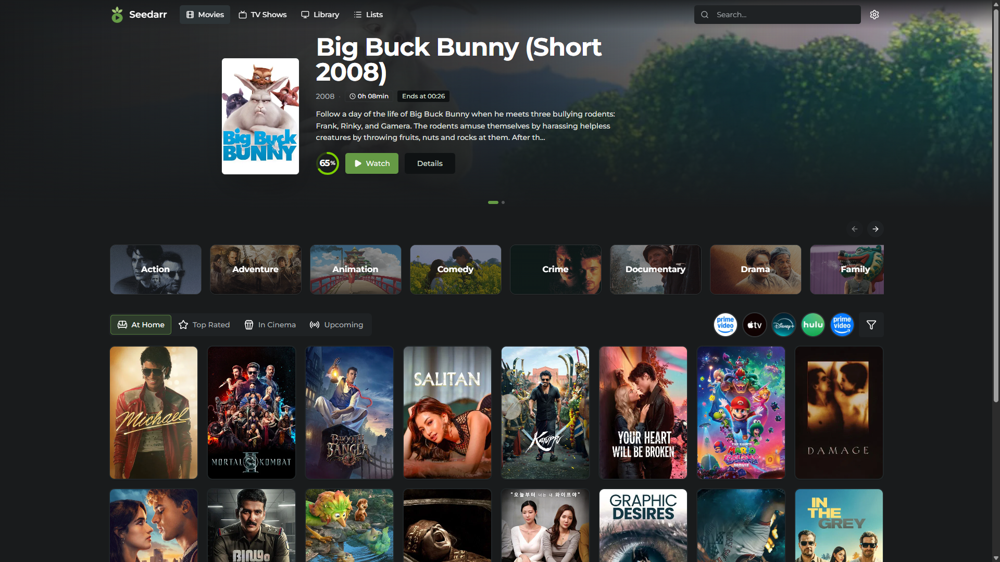
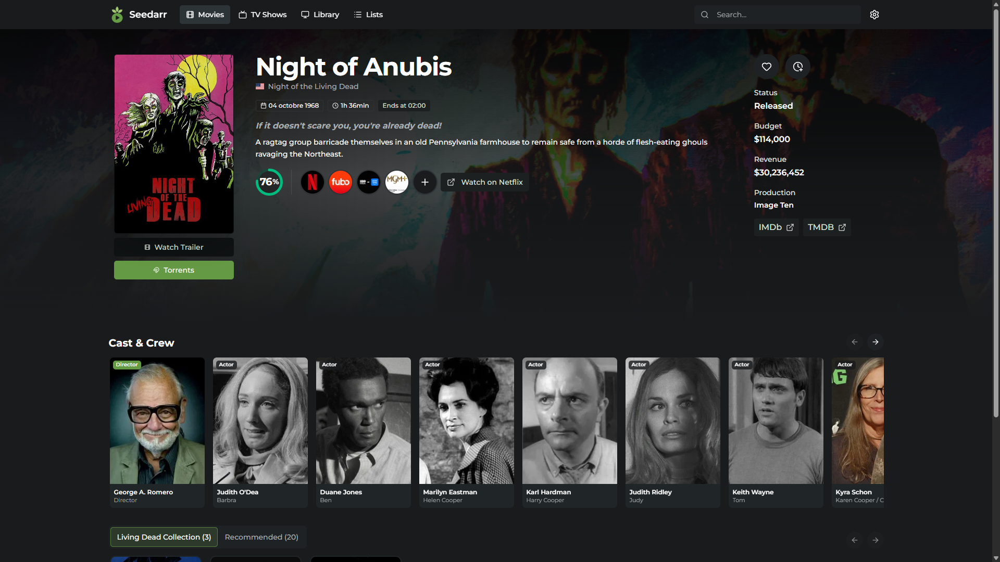
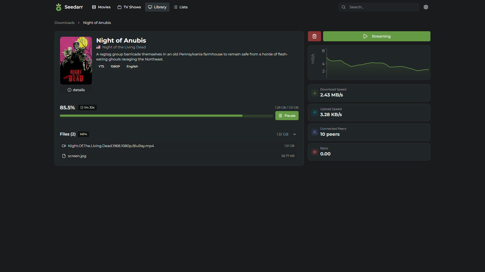
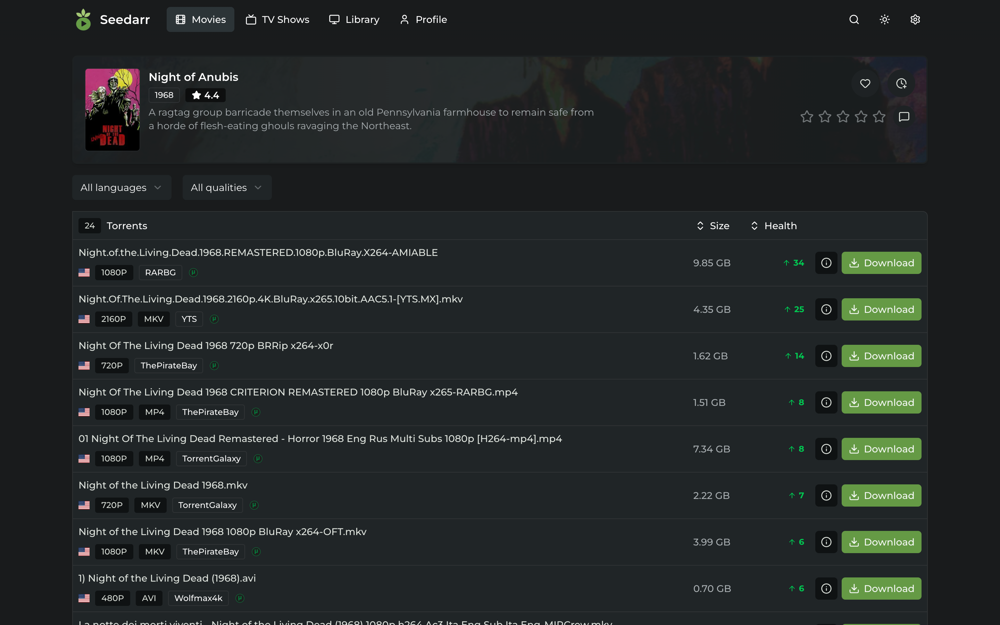
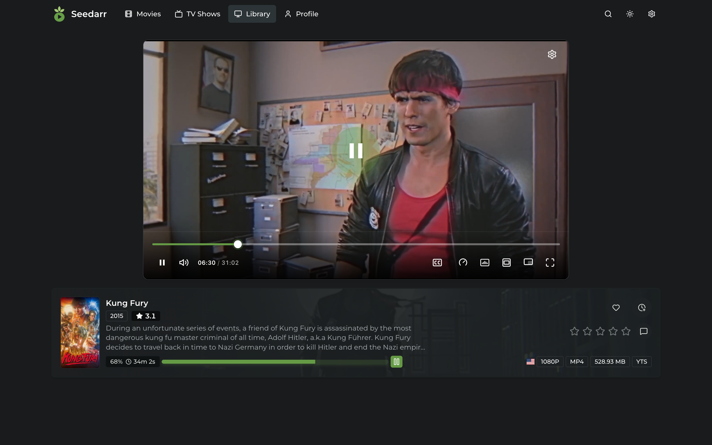

<p align="center">

</p>

<h1 align="center">Seedarr</h1>

<p align="center">
<b>Your self-hosted media center.</b><br>
Discover, download, and stream movies & TV shows — all from one place.
</p>

<p align="center">


</p>

---

**Seedarr** is a free, open-source, self-hosted web app that lets you browse the entire TMDB catalog, search torrents through your indexers, download them with a built-in torrent client, and **stream content directly in your browser** — even while it's still downloading.

Think of it as **Stremio meets Overseerr**, but fully self-hosted and under your control.

## Screenshots

### 🖥️ Dashboard

<p align="center">
  
</p>

### 🎬 Movie Details

<p align="center">
  
</p>

### 📥 Download Manager

<p align="center">
  
</p>

## Features

### Browse & Discover

- Full **TMDB catalog** — movies, TV shows, trending, popular, top rated, upcoming
- Rich metadata: trailers, ratings, cast, genres, backdrops
- Search across the entire TMDB database
- Personalized **Watchlist** and **Likes** to keep track of what you want to watch

### Torrent Search & Download

- Search torrents from **Stremio addons** (like Torrentio), **Jackett** or **Prowlarr** with live indexer status
- Built-in **WebTorrent client** — no external download client needed
- Real-time download progress, speed, peers, seeds, and ratio
- Pause, resume, and manage downloads directly from the UI
- Quality and language info displayed for each result
- Optional **remote storage** (FTP/FTPS or WebDAV) — transfer completed downloads to a NAS, Nextcloud, or any remote server

### Stream & Watch

- **Stream while downloading** — start watching before the download completes
- Integrated **video player** with full playback controls
- Automatic **subtitle detection** from downloaded files
- SRT to VTT conversion with encoding detection
- MKV to MP4 real-time **transcoding** via FFmpeg
- **Watch progress tracking** — resume where you left off

### Multi-User & Roles

- **Role-based access control**: Owner, Admin, Member, Viewer
- First user becomes the owner — no open registration by default
- Per-user watchlist, likes, watch history, and downloads
- **Guided onboarding** for new users

### Self-Hosted & Private

- Runs entirely on your hardware — your data stays yours
- Lightweight **SQLite** database, no external DB required
- **Docker** ready with a single `docker compose up`
- Responsive, **mobile-friendly** design
- Available in **English** and **French**

<!-- TODO: Add more screenshots
<details>
<summary><b>More screenshots</b></summary>
<br>
<p align="center">

<br><br>

<br><br>

<br><br>

<br><br>

</p>
</details>
-->

## Quick Start

### Docker (recommended)

> **Beta:** images are published automatically on every push to `main`. Use the `beta` tag for the latest build, or pin a specific version (e.g. `ghcr.io/artpou/seedarr:0.1.0-beta.0`).

```bash
mkdir seedarr && cd seedarr
curl -fsSL https://raw.githubusercontent.com/Artpou/seedarr/main/docker-compose.yml -o docker-compose.yml
docker compose pull
docker compose up -d
```

Seedarr will be available at **http://localhost:5551**. Create your account, configure your indexer (Jackett or Prowlarr), and start browsing.

**Update to the latest beta:**

```bash
docker compose pull && docker compose up -d
```

**Build locally from source** (contributors):

```bash
git clone https://github.com/Artpou/seedarr.git
cd seedarr
docker compose -f docker-compose.yml -f docker-compose.build.yml up -d --build
```

### Manual Setup

```bash
git clone https://github.com/Artpou/seedarr.git
cd seedarr
pnpm install
pnpm db:push
pnpm dev
```

Open **http://localhost:3000** — the API runs on port 3002.

> **Requirements:** Node.js 22.13+, pnpm 9+. Optional: [FFmpeg](https://ffmpeg.org/) for MKV transcoding.

## Roadmap

Seedarr is under active development. Here's what's coming next:

- [ ] **Instance customization** — custom logo, title, branding
- [ ] **Request system** — non-admin users can request content, admin approves via email notification
- [ ] **Direct URL streaming** — play from external links
- [ ] **Chromecast** — cast to your TV
- [ ] **Debrid support** — Real-Debrid, AllDebrid, Premiumize integration

## Contributing

Contributions are welcome! Whether it's fixing a bug, adding a feature, or improving translations.

Please read our [Contributing Guide](CONTRIBUTING.md) to learn how to set up the development environment and follow our coding standards.

## Acknowledgments

- [TMDB](https://www.themoviedb.org/) for their incredible API
- All the open-source projects that power Seedarr

---

<p align="center">
<sub>Seedarr is not affiliated with TMDB, Stremio, Prowlarr, or Jackett. This product uses the TMDB API but is not endorsed or certified by TMDB.</sub>
</p>
